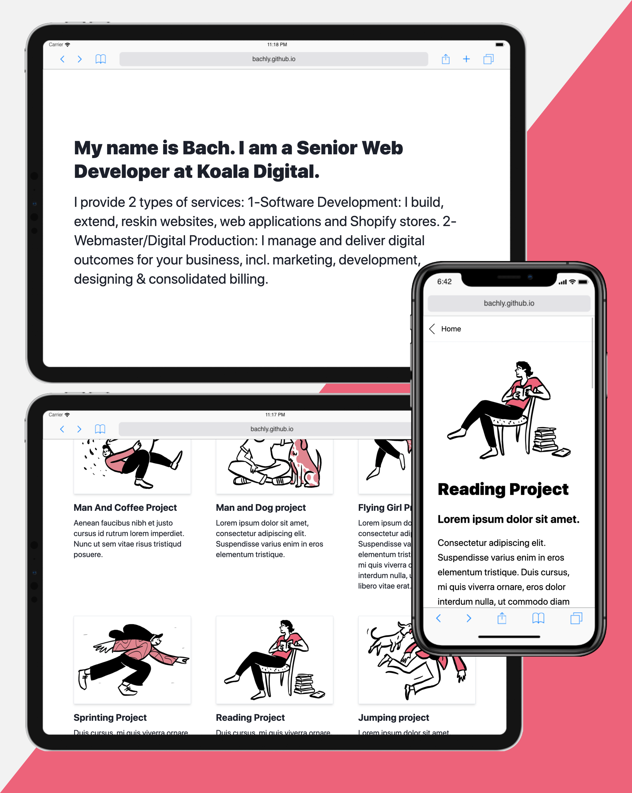

# KoalaDigital Mini Website - A simple 2-Page Website Template without CMS

DEMO: https://bachly.github.io/koaladigital-mini-website



This is self-contained 2-page Website template for Blog, Portfolio, Resume, CV, Profile, Project Showcase, Developer's Website.

Features:

- [NextJS 9.5](https://nextjs.org/docs/basic-features/pages)
- ReactJS
- [TailwindCSS](https://tailwindcss.com/docs)
- **No CMS** to store content. Only local Markdown files.
- Host it for **FREE** on GitHub Pages, Netlify, or Surge.SH

## How to use?

### Step 0 - Install

```shell
# Clone the GIT project to your local environment

$ yarn       # install node_modules
$ yarn dev   # start development on http://localhost:3000/
```

### Step 1 - Content

- Change the `.md` files in `content/projects`
- Change the `.md` file names. The file name becomes the URL e.g. `project-1.md` => `/project/project-1`

### Step 2 - Styles

- Generate your own favicons from [Favicon.io](https://favicon.io/) and put them in `public/images/favicon_io` directory
- Change to your own logo in `public/images/logo.png`

_Optional ways to extend the templates_

- _Update the Homepage in `index.js` and Project page in `project/[slug].js`_
- _Use `TailwindCSS` utility CSS classes to style your pages_
- _Extend `TailwindCSS` by [updating the tailwind.config.js](https://tailwindcss.com/docs/configuration)_

```shell
# After updating tailwind.config.js, run

$ yarn css   # this reates a new `/public/css/tailwind.css` file.
```

- \_Add your own Custom CSS: `/public/css/custom.css`.
- _Use [NextJS CSS Support](https://nextjs.org/docs/basic-features/built-in-css-support)_

### Step 3 - (Optional) Add new page

To add a new page suc

### Step 3 - (Optional) Add new content type

To add new content type such as `/blog/post-1`:

1. Copy `/content/projects` => `/content/blog`
1. Copy `/pages/projects/[slug].js` => `/pages/blog/[slug].js`
1. In the `/pages/blog/[slug].js`, update the source of `.md` files in `getInitialProps()` function. This is the Data Source during development and if you use NextJS as a server.
1. In the `/pages/index.js` file, copy the function `importProjectsMd()` => `importBlogsMd()` and update the `.md` file source accordingly. This is where Blog data is pulled into the Homepage.
1. In the `next.config.js`, add more exported paths into the `exportPathMap()` function. This is where exported paths of static pages are defined.

### Step 4 - Export and deploy

For GitHub Pages:

```shell
# Ensure the paths are defined in exportPathMap()

$ yarn out-github     # this creates the `docs` directory

$ git add docs        # commit the `docs` directory to Git

# In GitHub Pages settings, point to the `/docs` directory. This is the root of your static site.
```

For SurgeSH:

```shell
$ yarn global add surge   # install Surge.SH

$ yarn out                # this creates the `out` directory
$ cd out
$ surge
```

For Netlify:

```shell
$ yarn global add netlify-cli    # Install Netlify CLI
$ netlify login
$ netlify deploy -p
```

**IMPORTANT: If your are hosting the website under a sub-route or sub-path e.g. youwebsite.com/sub-path, update the `basePath` in the `next.config.js` file**

```javascript
// In next.config.js file

module.exports = {
    basePath: '/sub-path', // <-- Change this to your own sub-path
    webpack: ...
    exportPathMap: ...
}
```

## Images and Icons

- Generate your own favicons from [Favicon.io](https://favicon.io/) and put them in `public/images/favicon_io` directory
- Use free illustrations from [Open Doodles](https://www.opendoodles.com/)
- Use [Unplash API](https://source.unsplash.com/1500x1000/?nature,water) for random photos
- Use [Free Linear SVG icons](https://linearicons.com/free) and put them in the `components/Icons.js`

## Common CLI

Install the `node_modules`

```shell
$ yarn
```

Develop the pages on `http://localhost:3000`

```shell
$ yarn dev
```

To produce Static Website exports:

```shell
$ yarn out          # Export to `out` directory
$ yarn out-github   # Export to `docs` directory
```

(Optionally) To test the local static folders:

```shell
$ yarn global add http-server
$ cd docs           # or `cd out`
$ http-server       # this wil starts the http-server in the `docs` folder
```

To run a website on NextJS server:

```shell
$ yarn build        # build the optimised Production build if you use NextJS as a server
$ yarn start        # run the NextJS server and serve the Production build
```

## Notes

- Node version > `10.0.0` might be needed
